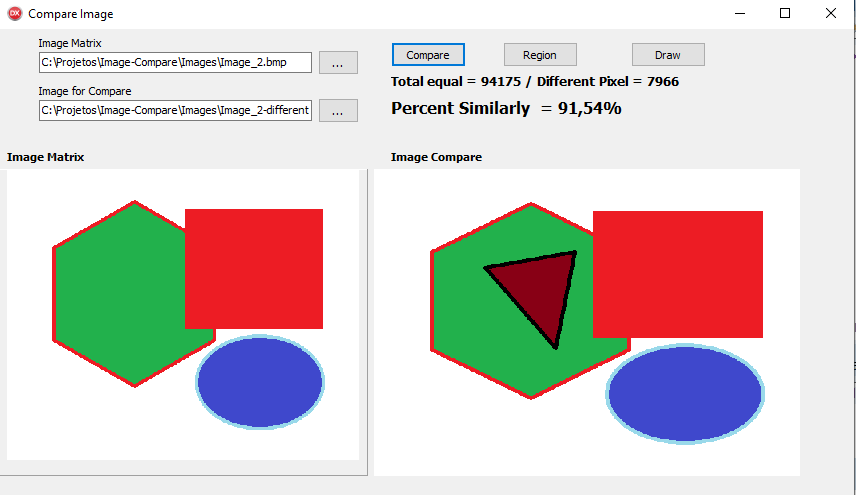

# Image-compare in Pure Delphi

## Compre two images e result the simillary in pixel.

## Project Running
<h1 align="center">
    
</h1>

## Status Project
	🚧 Em construção...  🚧
 
## Features
- [x] Compare image .bmp
- [x] Percent different in Pixel
- [ ] Find image
- [x] Draw Image the matrix
- [ ] Use new extensions .png .jpg

### Autor
---
<a href="https://www.flexnetsistemas.com.br/">
 
  
 <b>Ricardo de Assis</b></a> <a href="https://www.flexnetsistemas.com.br/" title="Flexnet">🚀</a>

Feito com ❤️ por Ricardo Assis 👋🏽 Entre em contato!

 

  
  
